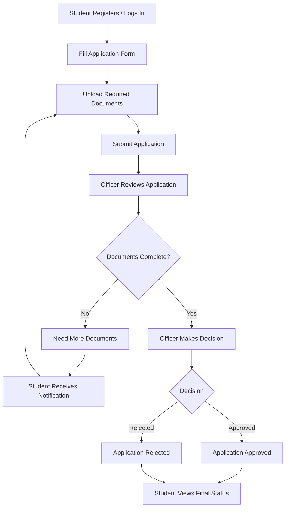
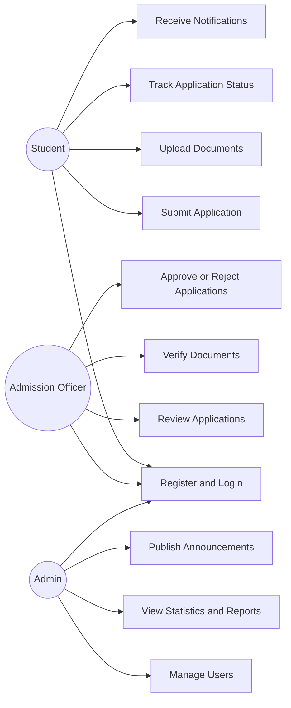
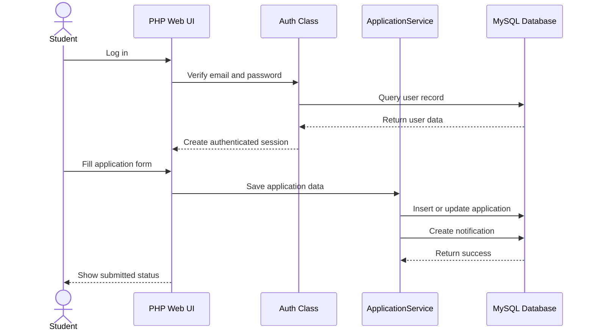
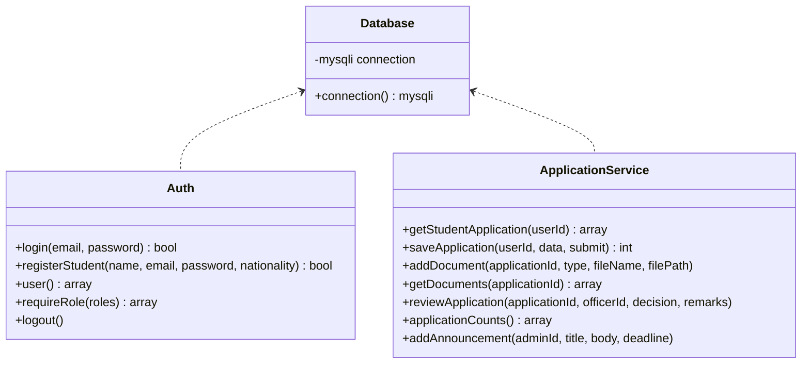
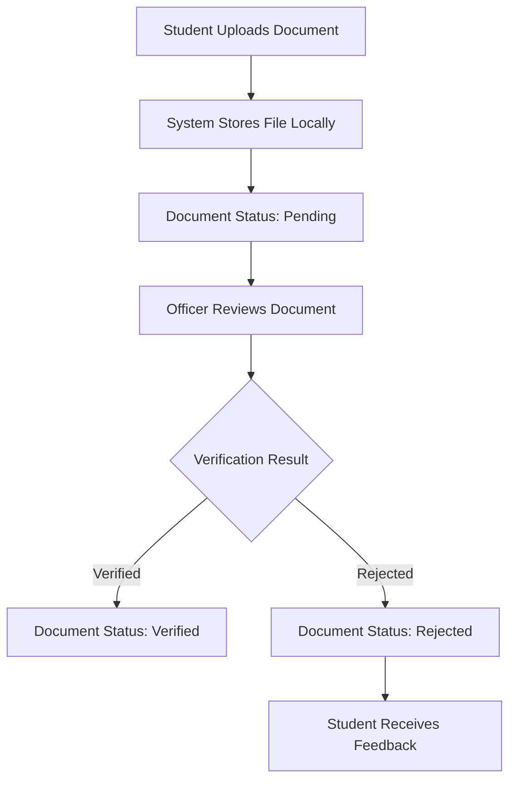

# WKU International Online Admission Management System

A PHP/MySQL web-based admission management system for international student applications at Wenzhou-Kean University.

This project is developed as a CPS3962 final project MVP and is designed to run directly in **WampServer**. It supports student application submission, document upload, officer review, application status tracking, notifications, and admin-level management.

---

## 1. Project Overview

The **WKU International Online Admission Management System** is a role-based admission platform for managing international student applications.

The system allows:

- Students to register, log in, submit applications, upload documents, and track admission status.
- Admission officers to review applications, verify documents, and make admission decisions.
- Admins to monitor system statistics, manage users, publish announcements, and generate reports.

The goal of this MVP is to demonstrate a complete online admission workflow using **PHP**, **MySQL**, and **WampServer**.

---

## 2. Technology Stack

| Layer | Technology |
|---|---|
| Frontend | HTML, CSS |
| Backend | PHP |
| Database | MySQL |
| Local Server | WampServer |
| Database Tool | phpMyAdmin |
| Architecture Style | MVC-like modular PHP structure |
| Security | Password hashing, prepared SQL statements, role-based access control |

---

## 3. Main Features

### Student Features

- Student registration and login
- Online application form
- Personal, passport, academic, program, and English score information submission
- Document upload
- Application status tracking
- Notification viewing
- Announcement viewing

### Admission Officer Features

- Officer login
- View submitted applications
- Review application details
- Verify or reject uploaded documents
- Add review remarks
- Update application status:
  - Under Review
  - Need More Documents
  - Approved
  - Rejected

### Admin Features

- Admin login
- View system statistics
- Manage users
- View application reports
- Publish announcements
- Set admission-related deadlines

---

## 4. Demo Accounts

| Role | Email | Password |
|---|---|---|
| Student | `student@wku.edu` | `student123` |
| Admission Officer | `officer@wku.edu` | `officer123` |
| Admin | `admin@wku.edu` | `admin123` |

---

## 5. System Workflow



---

## 6. Role-Based Use Case Diagram



---

## 7. Student Application Submission Sequence



---

## 8. Project Structure

```text
wku_admission/
│
├── assets/
│   └── styles.css
│
├── config/
│   └── database.php
│
├── database/
│   └── schema.sql
│
├── docs/
│   └── OOAD_Documentation.md
│
├── includes/
│   ├── ApplicationService.php
│   ├── Auth.php
│   ├── helpers.php
│   ├── header.php
│   └── footer.php
│
├── uploads/
│
├── index.php
├── register.php
├── student_dashboard.php
├── application_form.php
├── upload_document.php
├── officer_dashboard.php
├── review_application.php
├── admin_dashboard.php
└── README.md
```

---

## 9. Database Design

The database name is:

```text
wku_admission
```

Main database tables:

| Table | Description |
|---|---|
| `users` | Stores student, officer, and admin accounts |
| `applications` | Stores student application information and status |
| `documents` | Stores uploaded document metadata and verification status |
| `notifications` | Stores system notifications for users |
| `payments` | Stores application fee records |
| `reviews` | Stores officer review decisions and feedback |
| `announcements` | Stores admin announcements and deadlines |

---

## 10. Core PHP Classes



---

## 11. Installation and Running Guide

### Step 1: Start WampServer

Start WampServer and make sure the icon turns green.

### Step 2: Copy Project Folder

Copy the project folder into:

```text
C:\wamp64\www\wku_admission
```

The final path should look like:

```text
C:\wamp64\www\wku_admission
```

### Step 3: Create Database

Open phpMyAdmin:

```text
http://localhost/phpmyadmin
```

Create a new database named:

```text
wku_admission
```

### Step 4: Import SQL File

Import the following file into the `wku_admission` database:

```text
database/schema.sql
```

### Step 5: Open the System

Visit:

```text
http://localhost/wku_admission/
```

Then log in using one of the demo accounts.

---

## 12. Default Database Configuration

The default database configuration matches the standard WampServer MySQL setup:

| Item | Value |
|---|---|
| Host | `localhost` |
| Database | `wku_admission` |
| MySQL User | `root` |
| MySQL Password | empty |

Configuration file:

```text
config/database.php
```

---

## 13. Main Pages

| Page | File |
|---|---|
| Login Page | `index.php` |
| Student Registration | `register.php` |
| Student Dashboard | `student_dashboard.php` |
| Application Form | `application_form.php` |
| Document Upload | `upload_document.php` |
| Officer Dashboard | `officer_dashboard.php` |
| Review Application | `review_application.php` |
| Admin Dashboard | `admin_dashboard.php` |

---

## 14. Document Upload Design

Uploaded documents are stored locally under:

```text
uploads/app_{application_id}/
```

Example:

```text
uploads/app_1/passport.pdf
uploads/app_1/transcript.pdf
uploads/app_1/english_test.pdf
```

Supported document workflow:



---

## 15. Application Status Flow

| Status | Meaning |
|---|---|
| Draft | Student has started but not submitted the application |
| Submitted | Application has been submitted |
| Under Review | Officer is reviewing the application |
| Need More Documents | More or corrected documents are required |
| Approved | Application has been accepted |
| Rejected | Application has been rejected |

---

## 16. Security Design

This MVP includes several basic security practices:

- Passwords are stored using PHP password hashing.
- SQL operations use prepared statements.
- Pages are protected by session-based login checking.
- Role-based access control prevents students, officers, and admins from accessing unauthorized pages.
- Uploaded files are organized by application ID.

---

## 17. Test Plan

| Test Case | Steps | Expected Result | Status |
|---|---|---|---|
| TC-01 | Log in as student | Student dashboard opens | Pass |
| TC-02 | Log in as officer | Officer dashboard opens | Pass |
| TC-03 | Log in as admin | Admin dashboard opens | Pass |
| TC-04 | Student opens application form | Existing or empty form appears | Pass |
| TC-05 | Student uploads document | File is stored and marked pending | Pass |
| TC-06 | Officer reviews application | Applicant details and documents appear | Pass |
| TC-07 | Officer updates status | Student receives updated application status | Pass |
| TC-08 | Admin publishes announcement | Announcement appears for users | Pass |
| TC-09 | Import SQL schema | Tables and demo rows are created | Pass |
| TC-10 | Run PHP syntax check | No PHP syntax errors | Pass |

---

## 18. Known Issues

| Issue | Severity | Status |
|---|---|---|
| PowerShell does not support Bash-style SQL import redirection with `<` | Low | Fixed by using `Get-Content schema.sql \| mysql` |
| WampServer PHP may show an Xdebug DLL version warning in CLI | Low | Environment warning only; the web app still runs |

---

## 19. Project Highlights

- Complete admission workflow from student submission to officer decision.
- Three-role system: Student, Admission Officer, and Admin.
- Local deployment through WampServer.
- MySQL database with normalized admission-related tables.
- Document upload and verification workflow.
- Admin dashboard for statistics, reports, announcements, and deadlines.
- Suitable for classroom demonstration and final project presentation.

---

## 20. Future Improvements

Possible future improvements include:

- Email notification integration
- More detailed application fee management
- PDF export for admission reports
- Advanced search and filtering for officers
- Admin user editing and account suspension
- Stronger file validation for uploaded documents
- More responsive UI design
- Deployment to a real web server

---

## 21. User Acceptance Summary

The MVP supports the required international admission workflow, including student application submission, document upload, officer review, application status updates, notifications, admin monitoring, and announcements.

It is ready for classroom demonstration using the provided demo accounts.

---

## 22. License

This project is developed for academic coursework.
