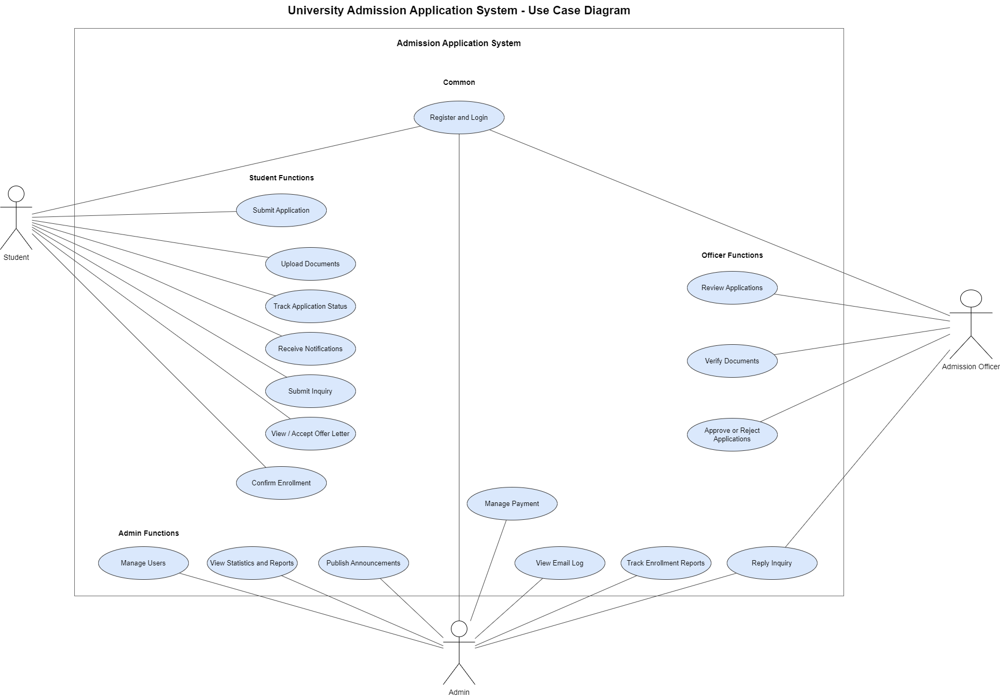
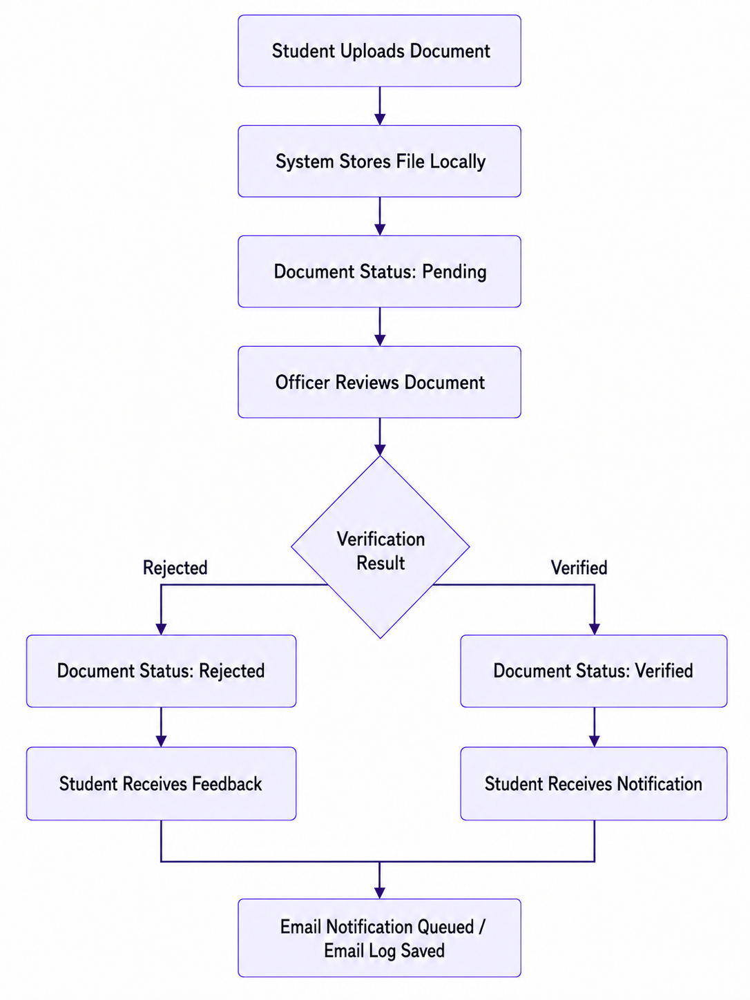

# WKU International Online Admission Management System

A PHP/MySQL web-based admission management system for international student applications at Wenzhou-Kean University.

This project was developed as a CPS3962 final project MVP. It is designed to run locally through **WampServer** and demonstrates a complete online admission workflow, including student application submission, document upload, officer review, admission decision processing, email notification logging, inquiry management, offer letter handling, enrollment confirmation, and admin-level reporting.

---

## Code Repository

The source code is available at:

https://github.com/EthanYixuanMi/WKU-Admission-System

---

## 1. Project Overview

The **WKU International Online Admission Management System** is a role-based admission platform for managing international student applications.

The system supports three major user roles:

* **Student**
* **Admission Officer**
* **Admin**

The system allows students to complete the admission process online, admission officers to review and process submitted applications, and admins to monitor system data, reports, users, payments, announcements, email logs, and enrollment progress.

The main goal of this MVP is to demonstrate a complete and practical online admission workflow using **PHP**, **MySQL**, and **WampServer**, while following object-oriented analysis and design principles.

---

## 2. Project Objective

The objective of this project is to develop a web-based platform for managing international student admissions for Wenzhou-Kean University.

The system is designed to streamline:

* Student application submission
* Document upload and verification
* Admission officer review
* Admission decision processing
* Student communication and inquiry handling
* Offer letter issuing and acceptance
* Enrollment confirmation
* Admin-level monitoring and reporting

---

## 3. Technology Stack

| Layer              | Technology                                                           |
| ------------------ | -------------------------------------------------------------------- |
| Frontend           | HTML, CSS                                                            |
| Backend            | PHP                                                                  |
| Database           | MySQL                                                                |
| Local Server       | WampServer                                                           |
| Database Tool      | phpMyAdmin                                                           |
| Architecture Style | MVC-like modular PHP structure                                       |
| Security           | Password hashing, prepared SQL statements, role-based access control |

---

## 4. Main Features

### 4.1 Student Features

* Student registration and login
* Online application form submission
* Personal, passport, academic, program, and English score information submission
* Document upload
* Application status tracking
* Application fee status tracking
* Offer letter viewing and acceptance
* Enrollment confirmation
* Notification viewing
* Inquiry submission and reply tracking
* Announcement viewing

### 4.2 Admission Officer Features

* Officer login
* View submitted applications
* Review application details
* Verify or reject uploaded documents
* Add document verification remarks
* Add application review remarks
* Update application status
* Approve or reject applications
* Respond to student inquiries
* Monitor offer and enrollment progress

Supported application status values include:

* Draft
* Submitted
* Under Review
* Need More Documents
* Approved
* Rejected

### 4.3 Admin Features

* Admin login
* View system statistics
* Manage users and admin profile information
* View application reports
* Manage application fee records
* Track enrollment reports
* View email notification logs
* Respond to student inquiries
* Publish announcements
* Set admission-related deadlines
* Monitor application progress

---

## 5. Demo Accounts

| Role              | Email                | Password     |
| ----------------- | -------------------- | ------------ |
| Student           | `1306031@wku.edu.cn` | `student123` |
| Student           | `1307943@wku.edu.cn` | `student123` |
| Admission Officer | `officer@wku.edu`    | `officer123` |
| Admin             | `admin@wku.edu`      | `admin123`   |

---

## 6. System Workflow

The overall admission workflow is:

1. Student registers or logs in.
2. Student fills in the online application form.
3. Student uploads required documents.
4. Student submits the application.
5. The system creates an application fee record.
6. Admission officer reviews the submitted application.
7. Officer verifies uploaded documents.
8. If documents are incomplete, the application status becomes **Need More Documents** and the student receives a notification.
9. If documents are complete, the officer makes an admission decision.
10. If approved, the system issues an offer letter.
11. Student views and accepts the offer letter.
12. Student confirms enrollment.
13. Admin tracks reports, payments, email logs, announcements, and enrollment status.


---

## 7. UML Diagrams

### 7.1 Use Case Diagram

The use case diagram shows the major actors and their corresponding functions.



### 7.2 Activity Diagram

The activity diagram shows the admission workflow with swimlanes for Student, System, Admission Officer, and Admin.


### 7.3 Sequence Diagram

The sequence diagram shows the chronological interactions among users, web interfaces, service classes, the email module, and the MySQL database.


### 7.4 Class Diagram

The class diagram shows the service-level classes, entities, attributes, methods, and relationships.


### 7.5 Document Verification Flow

This diagram focuses on the document upload and verification process.



---

## 8. Project Structure

```text
wku_admission/
│
├── assets/
│   └── styles.css
│
├── config/
│   ├── database.php
│   ├── mail.php
│   └── mail.local.php
│
├── database/
│   └── schema.sql
│
├── docs/
│   └── OOAD_Documentation.md
│
├── includes/
│   ├── ApplicationService.php
│   ├── Auth.php
│   ├── EmailService.php
│   ├── helpers.php
│   ├── header.php
│   └── footer.php
│
├── uploads/
│
├── index.php
├── register.php
├── student_dashboard.php
├── application_form.php
├── upload_document.php
├── officer_dashboard.php
├── review_application.php
├── admin_dashboard.php
└── README.md
```

---

## 9. Database Design

The database name is:

```text
wku_admission
```

The main database tables are:

| Table           | Description                                                                          |
| --------------- | ------------------------------------------------------------------------------------ |
| `users`         | Stores student, officer, and admin account information                               |
| `applications`  | Stores student admission application records and current application status          |
| `documents`     | Stores uploaded document metadata, local file path, verification status, and remarks |
| `notifications` | Stores system notifications for users                                                |
| `payments`      | Stores application fee records and payment status information                        |
| `reviews`       | Stores admission officer review decisions and feedback                               |
| `announcements` | Stores admin announcements and admission-related deadlines                           |
| `offer_letters` | Stores issued admission offers                                                       |
| `enrollments`   | Tracks offer acceptance and final enrollment confirmation                            |
| `inquiries`     | Stores student inquiries and staff replies                                           |
| `email_logs`    | Stores queued, sent, or failed email notification records                            |

---

## 10. Main Database Fields

| Table           | Main Fields                                                                                                                                                                                                |
| --------------- | ---------------------------------------------------------------------------------------------------------------------------------------------------------------------------------------------------------- |
| `users`         | `user_id`, `name`, `email`, `password_hash`, `role`, `phone`, `nationality`, `created_at`                                                                                                                  |
| `applications`  | `application_id`, `user_id`, `program`, `intake`, `date_of_birth`, `gender`, `passport_number`, `previous_school`, `gpa`, `english_score`, `personal_statement`, `status`, `submission_date`, `updated_at` |
| `documents`     | `document_id`, `application_id`, `type`, `file_name`, `file_path`, `status`, `remarks`, `uploaded_at`                                                                                                      |
| `notifications` | `notification_id`, `user_id`, `message`, `is_read`, `created_at`                                                                                                                                           |
| `payments`      | `payment_id`, `application_id`, `amount`, `status`, `paid_at`, `remarks`, `updated_at`                                                                                                                     |
| `reviews`       | `review_id`, `application_id`, `officer_id`, `decision`, `remarks`, `reviewed_at`                                                                                                                          |
| `announcements` | `announcement_id`, `title`, `body`, `deadline`, `created_by`, `created_at`                                                                                                                                 |
| `offer_letters` | `offer_id`, `application_id`, `offer_code`, `title`, `message`, `status`, `issued_at`, `updated_at`                                                                                                        |
| `enrollments`   | `enrollment_id`, `application_id`, `status`, `remarks`, `student_response_at`, `enrolled_at`, `updated_at`                                                                                                 |
| `inquiries`     | `inquiry_id`, `user_id`, `application_id`, `subject`, `message`, `response`, `status`, `responded_by`, `responded_at`, `created_at`, `updated_at`                                                          |
| `email_logs`    | `email_id`, `user_id`, `recipient_email`, `subject`, `body`, `status`, `error_message`, `created_at`                                                                                                       |

---

## 11. Main Pages

| Page                 | File                     |
| -------------------- | ------------------------ |
| Login Page           | `index.php`              |
| Student Registration | `register.php`           |
| Student Dashboard    | `student_dashboard.php`  |
| Application Form     | `application_form.php`   |
| Document Upload      | `upload_document.php`    |
| Officer Dashboard    | `officer_dashboard.php`  |
| Review Application   | `review_application.php` |
| Admin Dashboard      | `admin_dashboard.php`    |

---

## 12. User Interface Screens

The system provides browser-based user interfaces for students, admission officers, and administrators.

Main implemented screens include:

* Login page
* Student dashboard
* Online application form
* Document upload page
* Admission officer dashboard
* Application review page
* Admin dashboard
* Email notification evidence

Example screenshots are included in the report and project documentation.

---

## 13. Document Upload Design

Uploaded documents are stored locally under an application-related folder.

Example structure:

```text
uploads/app_{application_id}/
```

Example uploaded files:

```text
uploads/app_1/passport.pdf
uploads/app_1/transcript.pdf
uploads/app_1/english_test.pdf
```

Supported document types include:

* Passport
* Transcript
* English test result
* Recommendation document
* Other admission-related documents

Supported document verification status values include:

* Pending
* Verified
* Rejected

---

## 14. Application Status Flow

| Status              | Meaning                                               |
| ------------------- | ----------------------------------------------------- |
| Draft               | Student has started but not submitted the application |
| Submitted           | Application has been submitted                        |
| Under Review        | Officer is reviewing the application                  |
| Need More Documents | More or corrected documents are required              |
| Approved            | Application has been accepted                         |
| Rejected            | Application has been rejected                         |

---

## 15. Offer Letter and Enrollment Workflow

After an application is approved:

1. The system issues an offer letter.
2. The approved student can view the offer letter from the student dashboard.
3. The student can accept the offer.
4. The student can confirm enrollment.
5. The admin can track enrollment reports from the admin dashboard.

---

## 16. Inquiry Management

The system supports inquiry communication between students and staff.

Students can:

* Submit inquiries
* View inquiry history
* View staff replies

Admission officers or admins can:

* View student inquiries
* Reply to inquiries
* Update inquiry status

Supported inquiry status values include:

* Open
* Answered
* Closed

---

## 17. Email Notification Design

The system includes email notification support.

Default email settings are stored in:

```text
config/mail.php
```

Private SMTP credentials should be stored in:

```text
config/mail.local.php
```

The local SMTP credential file should not be committed to GitHub.

Example QQ Mail SMTP settings:

| Item       | Value                      |
| ---------- | -------------------------- |
| SMTP Host  | `smtp.qq.com`              |
| SMTP Port  | `465`                      |
| Encryption | `ssl`                      |
| Username   | QQ email address           |
| Password   | QQ SMTP authorization code |

If SMTP is not configured, the system can still record email notification attempts in the Admin Dashboard Email Log.

Email log status values include:

* Queued
* Sent
* Failed

---

## 18. Security Design

This MVP includes several basic security practices:

* Passwords are stored using PHP password hashing.
* SQL operations use prepared statements.
* Pages are protected by session-based login checking.
* Role-based access control prevents students, officers, and admins from accessing unauthorized pages.
* Uploaded files are organized by application ID.
* Private SMTP credentials are separated into `config/mail.local.php`.

---

## 19. Installation and Running Guide

### Step 1: Start WampServer

Start WampServer and make sure the icon turns green.

This means Apache and MySQL are running correctly.

### Step 2: Copy Project Folder

Copy the project folder into the WampServer `www` directory:

```text
C:\wamp64\www\wku_admission
```

The final project path should be:

```text
C:\wamp64\www\wku_admission
```

### Step 3: Open phpMyAdmin

Open a browser and visit:

```text
http://localhost/phpmyadmin
```

For a default WampServer setup, the usual login is:

```text
Username: root
Password: empty
```

### Step 4: Create Database

Create a new database named:

```text
wku_admission
```

Make sure the database name is exactly the same as above.

### Step 5: Import SQL Schema

After creating the database, select the `wku_admission` database in phpMyAdmin.

Import the SQL file:

```text
database/schema.sql
```

This SQL file creates the database tables and inserts demo data.

### Step 6: Check Database Configuration

Open the database configuration file:

```text
config/database.php
```

The default database configuration matches the standard WampServer MySQL setup:

| Item           | Value           |
| -------------- | --------------- |
| Host           | `localhost`     |
| Database       | `wku_admission` |
| MySQL User     | `root`          |
| MySQL Password | empty           |

### Step 7: Optional Email Configuration

Check the email configuration files:

```text
config/mail.php
config/mail.local.php
```

The default email settings are stored in `config/mail.php`.

Private SMTP credentials can be stored in `config/mail.local.php`.

If SMTP is not configured, the system can still record email notification attempts in the admin email log.

### Step 8: Open the System

Open the system in a browser:

```text
http://localhost/wku_admission/
```

Then log in using one of the demo accounts.

---

## 20. Deployment Verification Checklist

After deployment, verify the following items:

| Check Item       | Expected Result                                                |
| ---------------- | -------------------------------------------------------------- |
| WampServer icon  | Green                                                          |
| Project URL      | `http://localhost/wku_admission/` opens successfully           |
| Database         | `wku_admission` exists in phpMyAdmin                           |
| Database tables  | Required tables are created                                    |
| Student login    | Student dashboard opens                                        |
| Officer login    | Officer dashboard opens                                        |
| Admin login      | Admin dashboard opens                                          |
| Application form | Student can view or edit application                           |
| Document upload  | Upload page opens and stores uploaded files                    |
| Admin dashboard  | Reports, payments, email logs, and enrollment data are visible |

---

## 21. Test Plan and Results

The system was tested as a local PHP/MySQL web application running through WampServer.

Test environment:

| Item         | Value                             |
| ------------ | --------------------------------- |
| Local Server | WampServer 64-bit                 |
| Web URL      | `http://localhost/wku_admission/` |
| PHP Version  | PHP 8.x through WampServer        |
| Database     | MySQL database `wku_admission`    |
| Browser      | Google Chrome                     |
| Test Date    | June 4, 2026                      |

### Test Cases

| Test ID | Module                        | Test Scenario                                                            | Actual Result                                                                                                                                                           | Status |
| ------- | ----------------------------- | ------------------------------------------------------------------------ | ----------------------------------------------------------------------------------------------------------------------------------------------------------------------- | ------ |
| TC-01   | Student Login                 | Student logs in with a valid demo account.                               | Student dashboard opened successfully and displayed application, payment, offer, enrollment, notification, inquiry, and announcement information.                       | Pass   |
| TC-02   | Officer Login                 | Admission officer logs in with a valid demo account.                     | Officer dashboard opened successfully and displayed submitted applications and review-related functions.                                                                | Pass   |
| TC-03   | Admin Login                   | Admin logs in with a valid demo account.                                 | Admin dashboard opened successfully with reports, statistics, user management, payment management, announcements, enrollment reports, and email logs.                   | Pass   |
| TC-04   | Application Form              | Student opens the online application form.                               | The form displayed program, intake, personal information, passport information, academic background, English score, and personal statement fields.                      | Pass   |
| TC-05   | Document Upload               | Student opens the document upload page and uploads admission documents.  | The upload page displayed document type selection, file upload control, and uploaded document records.                                                                  | Pass   |
| TC-06   | Officer Document Verification | Officer opens the application review page and checks uploaded documents. | The review page displayed document verification controls and allowed document status updates with remarks.                                                              | Pass   |
| TC-07   | Application Decision          | Officer updates the application decision to Approved.                    | The application status was updated to Approved, review history was recorded, and notification/email records were generated.                                             | Pass   |
| TC-08   | Offer Letter                  | Approved student checks the student dashboard.                           | The offer letter was issued and displayed to the student, and the student was able to accept it.                                                                        | Pass   |
| TC-09   | Enrollment Tracking           | Student accepts the offer and confirms enrollment.                       | The enrollment status was updated to Enrolled and appeared in the admin enrollment report.                                                                              | Pass   |
| TC-10   | Student Inquiry               | Student opens the inquiry page and views inquiry history.                | The inquiry page displayed student questions and staff replies.                                                                                                         | Pass   |
| TC-11   | Staff Inquiry Response        | Officer or admin opens the inquiry management section.                   | Staff could view student inquiries, enter replies, and update inquiry status.                                                                                           | Pass   |
| TC-12   | Payment Management            | Admin opens the payment management section.                              | Payment records were displayed and could be managed from the admin dashboard.                                                                                           | Pass   |
| TC-13   | Email Notification Log        | Admin checks the email log after workflow actions.                       | The email log displayed notification records with delivery statuses such as Sent or Failed.                                                                             | Pass   |
| TC-14   | Real Email Notification       | Student checks the real mailbox after workflow actions.                  | The student mailbox received admission-related emails, including application submitted, document verified, application approved, and offer letter issued notifications. | Pass   |
| TC-15   | SQL Schema Import             | Import `database/schema.sql` into MySQL.                                 | The `wku_admission` database contained all required tables and demo rows.                                                                                               | Pass   |
| TC-16   | PHP Syntax Check              | Run PHP syntax checks on all PHP files.                                  | All PHP files passed syntax validation without syntax errors.                                                                                                           | Pass   |

### Test Summary

| Result Type      | Count |
| ---------------- | ----- |
| Total Test Cases | 16    |
| Passed           | 16    |
| Failed           | 0     |
| Pass Rate        | 100%  |

The final testing result is **Pass**.

---

## 22. Known Issues

| Issue                                                                      | Severity | Status        | Explanation                                                                                        |
| -------------------------------------------------------------------------- | -------- | ------------- | -------------------------------------------------------------------------------------------------- |
| PowerShell does not support Bash-style SQL import redirection with `<`     | Low      | Fixed         | The issue was solved by using `Get-Content schema.sql \| mysql` instead of Bash-style redirection. |
| WampServer PHP may report an Xdebug DLL version warning in CLI environment | Low      | Known warning | This warning does not affect the running web application.                                          |

---

## 23. Troubleshooting

| Problem                                       | Possible Reason                                  | Solution                                                    |
| --------------------------------------------- | ------------------------------------------------ | ----------------------------------------------------------- |
| WampServer icon is not green                  | Apache or MySQL is not running                   | Restart WampServer or check port conflict                   |
| Cannot open `http://localhost/wku_admission/` | Project folder is in the wrong location          | Make sure the folder is under `C:\wamp64\www\wku_admission` |
| Database connection error                     | Wrong database name, username, or password       | Check `config/database.php`                                 |
| Login fails                                   | SQL file not imported or demo data missing       | Re-import `database/schema.sql`                             |
| Tables do not exist                           | SQL import failed                                | Import `database/schema.sql` again in phpMyAdmin            |
| File upload does not work                     | Upload folder permission issue or missing folder | Check the `uploads/` folder                                 |
| Email not sent                                | SMTP is not configured                           | Configure `config/mail.local.php` or check the email log    |

---

## 24. Project Highlights

* Complete admission workflow from student application submission to officer decision.
* Three-role system: Student, Admission Officer, and Admin.
* Local deployment through WampServer.
* MySQL database with normalized admission-related tables.
* Document upload and verification workflow.
* Offer letter and enrollment confirmation workflow.
* Student inquiry and staff reply workflow.
* Email notification log for queued, sent, or failed email attempts.
* Admin dashboard for statistics, reports, payments, announcements, deadlines, enrollment tracking, and email logs.
* Suitable for classroom demonstration and final project presentation.

---

## 25. Future Improvements

Possible future improvements include:

* Cloud server deployment
* HTTPS support
* Real online payment integration
* More advanced reporting and analytics
* Improved UI design
* More detailed role permission management
* Advanced search and filtering for admission officers
* PDF export for offer letters and admission reports
* Large-scale performance testing

---

## 26. Team Contribution

| Member      | Main Contribution                                                                   |
| ----------- | ----------------------------------------------------------------------------------- |
| Yunxi Zhao  | Requirements analysis, documentation support, and presentation preparation          |
| Yixuan Mi   | System implementation, database design, GitHub organization, and report integration |
| Qiyang Yu   | UML diagrams, testing support, and workflow validation                              |
| Sihang Wang | UI screenshots, deployment testing, and final presentation support                  |

This project was completed as a group project. Although the tasks were divided, all members were expected to understand the complete project workflow, including requirements, design, database structure, implementation, testing, and deployment.

---

## 27. User Acceptance Summary

The MVP supports the required international admission workflow, including:

* Student application submission
* Document upload
* Officer review
* Document verification
* Application decision update
* Offer letter handling
* Enrollment confirmation
* Notifications
* Inquiry management
* Payment management
* Email log checking
* Admin monitoring
* Announcement publishing
* Deployment through WampServer

The system is ready for classroom demonstration and final project submission using the provided demo accounts.

---

## 28. License

This project is developed for academic coursework.
