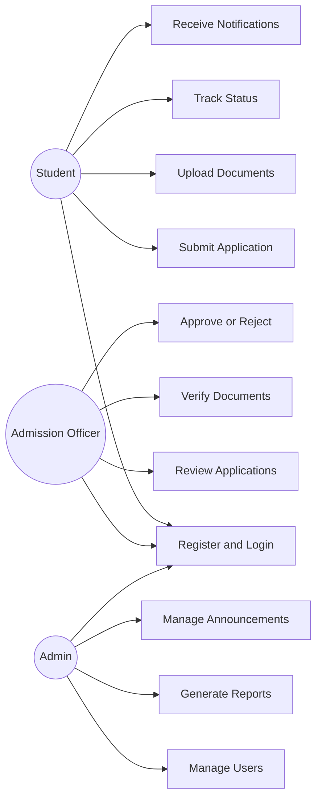
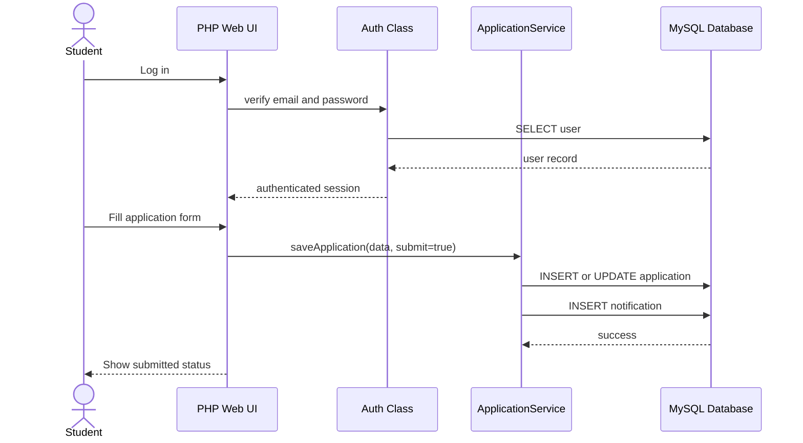
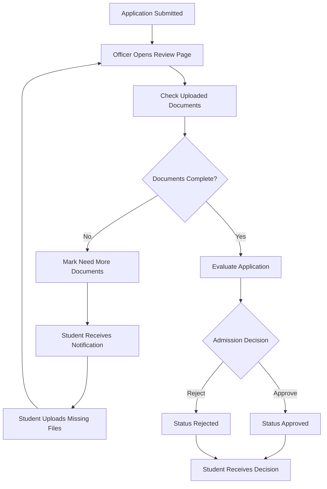
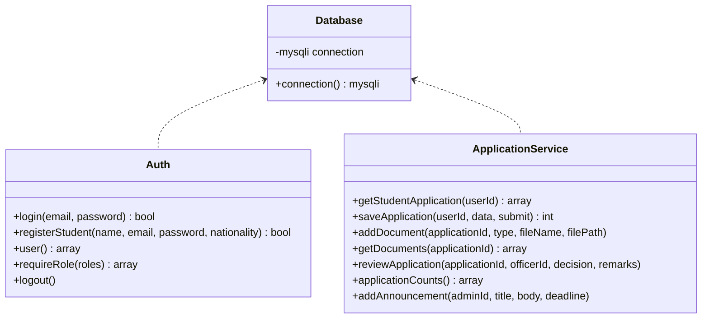

# International Online Admission Management System for WKU

## 1. Project Objective

The system is a web-based admission management platform for international student applications at Wenzhou-Kean University. It supports application submission, document upload, officer verification, admission decisions, student notifications, and administrative reporting.

## 2. Stakeholders and Roles

| Role | Main Responsibility |
|---|---|
| Student | Register, log in, submit application, upload documents, track status, receive decisions |
| Admission Officer | Review applications, verify documents, approve/reject applications, send feedback |
| Admin | Manage users, monitor statistics, publish announcements, generate admission reports |

## 3. Functional Requirements

| ID | Requirement |
|---|---|
| FR-01 | Students can register and log in. |
| FR-02 | Officers and admins can log in with role-based access. |
| FR-03 | Students can fill in academic, personal, passport, program, and English score information. |
| FR-04 | Students can upload passport, transcript, English test, recommendation, and other documents. |
| FR-05 | Students can view application status and notifications. |
| FR-06 | Officers can view submitted applications. |
| FR-07 | Officers can verify or reject uploaded documents with remarks. |
| FR-08 | Officers can mark applications as Under Review, Need More Documents, Approved, or Rejected. |
| FR-09 | Admins can view user, application, and document statistics. |
| FR-10 | Admins can publish announcements and deadlines. |

## 4. Non-Functional Requirements

| ID | Requirement |
|---|---|
| NFR-01 | Use prepared SQL statements to reduce SQL injection risk. |
| NFR-02 | Store passwords with PHP password hashing. |
| NFR-03 | Provide role-based access control. |
| NFR-04 | Use a responsive interface for desktop and mobile screens. |
| NFR-05 | Support fast document upload and retrieval through local WampServer storage. |
| NFR-06 | Keep database tables normalized around users, applications, documents, reviews, payments, and notifications. |

## 5. Use Case Descriptions

| Use Case | Actor | Main Flow |
|---|---|---|
| Register Account | Student | Student enters name, email, nationality, and password; system creates a student account. |
| Submit Application | Student | Student completes application form and submits it; system changes status to Submitted. |
| Upload Document | Student | Student selects document type and uploads a file; system stores it as Pending. |
| Track Application | Student | Student opens dashboard and views status, documents, notifications, and announcements. |
| Verify Document | Officer | Officer opens application, reviews each file, and marks it Verified or Rejected. |
| Make Decision | Officer | Officer selects final or intermediate decision and writes remarks. |
| Monitor Reports | Admin | Admin opens dashboard to view statistics and application report. |
| Publish Announcement | Admin | Admin writes announcement and optional deadline; system notifies students. |

## 6. UML Diagrams

### 6.1 Use Case Diagram

### 6.2 Sequence Diagram: Student Application Submission

### 6.3 Activity Diagram: Application Review Workflow

### 6.4 Class Diagram

## 7. Database Schema

| Table | Purpose |
|---|---|
| users | Stores students, officers, and admins |
| applications | Stores admission application details and status |
| documents | Stores uploaded document metadata and verification status |
| notifications | Stores student/officer/admin notification messages |
| payments | Stores application fee records |
| reviews | Stores officer decisions and feedback |
| announcements | Stores admin announcements and deadlines |

## 8. UI Screens

| Screen | File |
|---|---|
| Login | `index.php` |
| Student Registration | `register.php` |
| Student Dashboard | `student_dashboard.php` |
| Application Form | `application_form.php` |
| Document Upload | `upload_document.php` |
| Officer Dashboard | `officer_dashboard.php` |
| Review Application | `review_application.php` |
| Admin Dashboard | `admin_dashboard.php` |

## 9. Test Plan and Results

| Test Case | Steps | Expected Result | Status |
|---|---|---|---|
| TC-01 Login as student | Use `student@wku.edu / student123` | Student dashboard opens | Pass |
| TC-02 Login as officer | Use `officer@wku.edu / officer123` | Officer review dashboard opens | Pass |
| TC-03 Login as admin | Use `admin@wku.edu / admin123` | Admin dashboard opens | Pass |
| TC-04 View application form | Student opens application form | Existing application data appears | Pass |
| TC-05 View review page | Officer opens application #1 | Applicant details and documents appear | Pass |
| TC-06 SQL schema import | Import `database/schema.sql` | Tables and demo rows are created | Pass |
| TC-07 PHP syntax check | Run `php -l` on project files | No PHP syntax errors | Pass |

## 10. Bug Report

| Bug | Severity | Status |
|---|---|---|
| PowerShell does not support Bash-style SQL import redirection with `<` | Low | Fixed by using `Get-Content schema.sql | mysql` |
| WampServer PHP reports an Xdebug DLL version warning in CLI | Low | Known environment warning; web app still runs |

## 11. User Acceptance Summary

The MVP supports the required admission workflow: student application submission, document upload, officer review, status updates, notifications, admin monitoring, and announcements. The system is ready for classroom demonstration using the provided demo accounts.

## 12. Deployment Guide

1. Copy the project folder to `C:\wamp64\www\wku_admission`.
2. Start WampServer.
3. Import `database/schema.sql` into MySQL.
4. Open `http://localhost/wku_admission/`.
5. Log in with the demo accounts.
