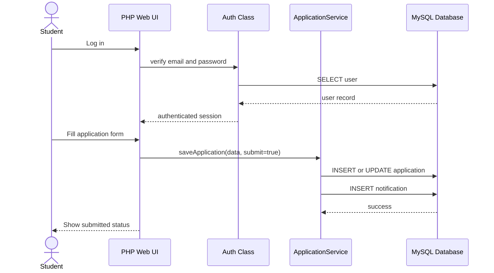
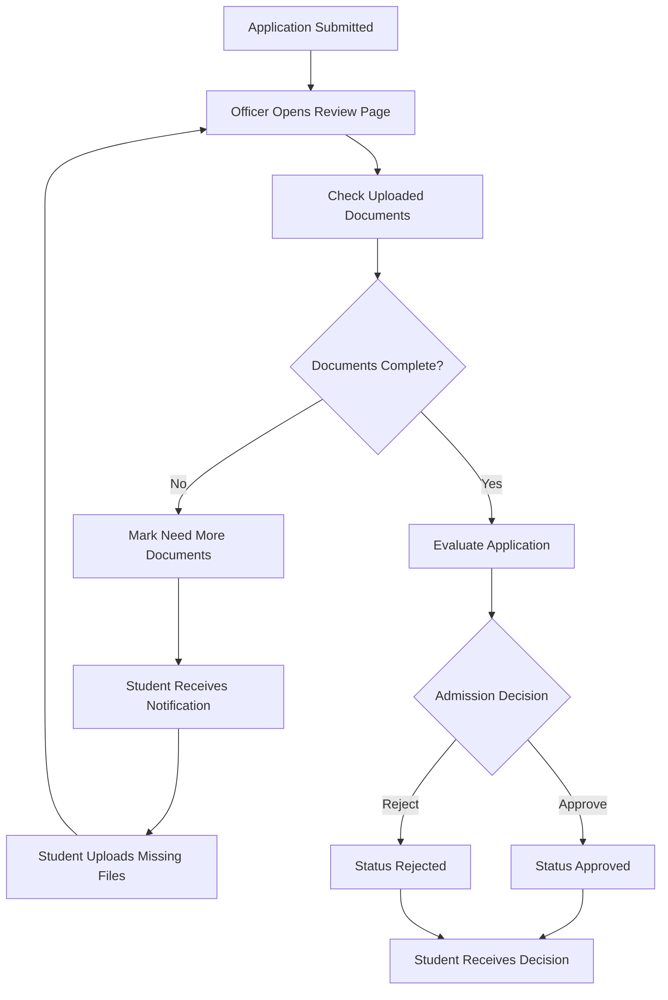
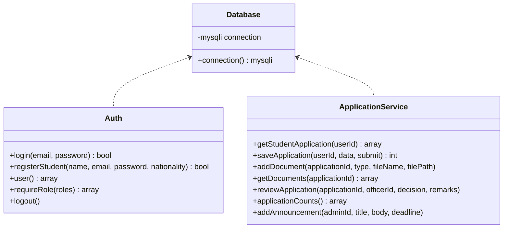

# International Online Admission Management System for WKU

## 1. Project Objective

The system is a web-based admission management platform for international student applications at Wenzhou-Kean University. It supports application submission, document upload, officer verification, admission decisions, student notifications, and administrative reporting.

## 2. Stakeholders and Roles

| Role | Main Responsibility |
|---|---|
| Student | Register, log in, submit application, upload documents, track status, receive decisions |
| Admission Officer | Review applications, verify documents, approve/reject applications, send feedback |
| Admin | Manage users, monitor statistics, publish announcements, generate admission reports |

## 3. Functional Requirements

| ID | Requirement |
|---|---|
| FR-01 | Students can register and log in. |
| FR-02 | Officers and admins can log in with role-based access. |
| FR-03 | Students can fill in academic, personal, passport, program, and English score information. |
| FR-04 | Students can upload passport, transcript, English test, recommendation, and other documents. |
| FR-05 | Students can view application status and notifications. |
| FR-06 | Officers can view submitted applications. |
| FR-07 | Officers can verify or reject uploaded documents with remarks. |
| FR-08 | Officers can mark applications as Under Review, Need More Documents, Approved, or Rejected. |
| FR-09 | Admins can view user, application, and document statistics. |
| FR-10 | Admins can publish announcements and deadlines. |
| FR-11 | Students can submit inquiries and view staff replies. |
| FR-12 | Approved students can view and accept offer letters. |
| FR-13 | Students can confirm enrollment after accepting an offer. |
| FR-14 | Admins can manage payment records and user roles. |
| FR-15 | The system records queued email notifications for later SMTP delivery. |

## 4. Non-Functional Requirements

| ID | Requirement |
|---|---|
| NFR-01 | Use prepared SQL statements to reduce SQL injection risk. |
| NFR-02 | Store passwords with PHP password hashing. |
| NFR-03 | Provide role-based access control. |
| NFR-04 | Use a responsive interface for desktop and mobile screens. |
| NFR-05 | Support fast document upload and retrieval through local WampServer storage. |
| NFR-06 | Keep database tables normalized around users, applications, documents, reviews, payments, notifications, inquiries, offers, and enrollments. |

## 5. Use Case Descriptions

| Use Case | Actor | Main Flow |
|---|---|---|
| Register Account | Student | Student enters name, email, nationality, and password; system creates a student account. |
| Submit Application | Student | Student completes application form and submits it; system changes status to Submitted. |
| Upload Document | Student | Student selects document type and uploads a file; system stores it as Pending. |
| Track Application | Student | Student opens dashboard and views status, documents, notifications, and announcements. |
| Verify Document | Officer | Officer opens application, reviews each file, and marks it Verified or Rejected. |
| Make Decision | Officer | Officer selects final or intermediate decision and writes remarks. |
| Monitor Reports | Admin | Admin opens dashboard to view statistics and application report. |
| Publish Announcement | Admin | Admin writes announcement and optional deadline; system notifies students. |

## 6. UML Diagrams

### 6.1 Use Case Diagram

### 6.2 Sequence Diagram: Student Application Submission

### 6.3 Activity Diagram: Application Review Workflow

### 6.4 Class Diagram

## 7. Database Schema

| Table | Purpose |
|---|---|
| users | Stores students, officers, and admins |
| applications | Stores admission application details and status |
| documents | Stores uploaded document metadata and verification status |
| notifications | Stores student/officer/admin notification messages |
| payments | Stores application fee records |
| reviews | Stores officer decisions and feedback |
| announcements | Stores admin announcements and deadlines |
| offer_letters | Stores issued admission offers |
| enrollments | Tracks offer acceptance and enrollment confirmation |
| inquiries | Stores student questions and staff replies |
| email_logs | Stores queued email notification records |

## 8. UI Screens

| Screen | File |
|---|---|
| Login | `index.php` |
| Student Registration | `register.php` |
| Student Dashboard | `student_dashboard.php` |
| Application Form | `application_form.php` |
| Document Upload | `upload_document.php` |
| Officer Dashboard | `officer_dashboard.php` |
| Review Application | `review_application.php` |
| Admin Dashboard | `admin_dashboard.php` |

## 9. Test Plan and Results

### 9.1 Test Environment

| Item | Value |
|---|---|
| Local Server | WampServer 64-bit |
| Web URL | `http://localhost/WKU-Admission-System/` |
| PHP Version | PHP 8.x through WampServer |
| Database | MySQL `wku_admission` |
| Browser | Google Chrome |
| Test Date | June 4, 2026 |

### 9.2 Demo Accounts Used

| Role | Account | Password |
|---|---|---|
| Student | `1306031@wku.edu.cn` | `student123` |
| Student | `1307943@wku.edu.cn` | `student123` |
| Admission Officer | `officer@wku.edu` | `officer123` |
| Admin | `admin@wku.edu` | `admin123` |

### 9.3 Test Case Record

| Test Case | Steps | Expected Result | Actual Result | Evidence | Status |
|---|---|---|---|---|---|
| TC-01 Student Login | Open login page and log in with `1306031@wku.edu.cn / student123`. | Student dashboard opens. | Student dashboard opened successfully for Steve. | `02-student-dashboard-steve.png` | Pass |
| TC-02 Officer Login | Log out and log in with `officer@wku.edu / officer123`. | Officer dashboard opens. | Officer review dashboard opened successfully. | `06-officer-dashboard.png` | Pass |
| TC-03 Admin Login | Log out and log in with `admin@wku.edu / admin123`. | Admin dashboard opens. | Admin dashboard opened successfully with reports and statistics. | `09-admin-dashboard-full.png` | Pass |
| TC-04 Application Form | Student opens the online application form. | Existing application information appears and can be edited. | Application form displayed program, intake, personal, passport, academic, and English score fields. | `03-student-application-form.png` | Pass |
| TC-05 Document Upload View | Student opens document upload page. | Upload form and uploaded document list appear. | Document upload page displayed document type, file upload control, and uploaded document records. | `04-student-document-upload.png` | Pass |
| TC-06 Officer Document Verification | Officer opens application review page and checks uploaded documents. | Documents can be marked Pending, Verified, or Rejected with remarks. | Application review page displayed document verification controls and verified document records. | `07-officer-review-application.png` | Pass |
| TC-07 Application Decision | Officer updates application decision to Approved. | Application status changes and review history is recorded. | Application was marked Approved and review history was displayed. | `07-officer-review-application.png`, `14-email-application-approved.jpg` | Pass |
| TC-08 Offer Letter | Student dashboard displays offer letter after approval. | Offer letter appears and student can accept it. | Offer letter was issued and accepted. | `02-student-dashboard-steve.png`, `13-email-offer-letter-issued.jpg` | Pass |
| TC-09 Enrollment Tracking | Student accepts offer and confirms enrollment. | Enrollment status updates to Enrolled. | Admin enrollment report showed the enrolled student record. | `10-admin-enrollment-report.png` | Pass |
| TC-10 Student Inquiry | Student opens inquiry page and views inquiry history. | Student can submit inquiries and view replies. | Inquiry history displayed an answered enrollment question. | `05-student-inquiries.png` | Pass |
| TC-11 Staff Inquiry Response | Officer/Admin opens inquiry management page. | Staff can view and reply to student inquiries. | Inquiry management page showed question, reply, responder, and status. | `08-staff-inquiry-management.png`, `12-admin-inquiry-management.png` | Pass |
| TC-12 Payment Management | Admin opens payment management section and updates payment status. | Payment records can be viewed and updated. | Payment management table appeared in admin dashboard. | `09-admin-dashboard-full.png` | Pass |
| TC-13 Email Notification Log | Admin checks Email Log after workflow actions. | Email delivery attempts are recorded as Sent or Failed. | Email Log displayed sent notification records. | `11-admin-email-log.png` | Pass |
| TC-14 Real Email Notification | Check the real student email inbox after workflow actions. | Student receives admission notification emails. | Student mailbox received application submitted, document status, approved, and offer letter emails. | `13-email-offer-letter-issued.jpg`, `14-email-application-approved.jpg`, `15-email-document-verified.jpg`, `17-email-application-submitted.jpg` | Pass |
| TC-15 SQL Schema Import | Import `database/schema.sql` into MySQL. | All database tables and demo rows are created. | `wku_admission` database contained all required tables and four demo users. | Database verification command output | Pass |
| TC-16 PHP Syntax Check | Run `php -l` on all PHP files. | No PHP syntax errors. | All PHP files passed syntax check. | CLI verification output | Pass |

## 10. Bug Report

| Bug | Severity | Status |
|---|---|---|
| PowerShell does not support Bash-style SQL import redirection with `<` | Low | Fixed by using `Get-Content schema.sql | mysql` |
| WampServer PHP reports an Xdebug DLL version warning in CLI | Low | Known environment warning; web app still runs |

## 11. Group Contribution

### 11.1 Group Members

| Member | College | University | Location | Email |
|---|---|---|---|---|
| Yunxi Zhao | College of Science, Mathematics and Technology | Wenzhou-Kean University | Wenzhou, China | `1307816@wku.edu.cn` |
| Yixuan Mi | College of Science, Mathematics and Technology | Wenzhou-Kean University | Wenzhou, China | `1307943@wku.edu.cn` |
| Qiyang Yu | College of Science, Mathematics and Technology | Wenzhou-Kean University | Wenzhou, China | `1306031@wku.edu.cn` |
| Sihang Wang | College of Science, Mathematics and Technology | Wenzhou-Kean University | Wenzhou, China | `1337436@wku.edu.cn` |

### 11.2 Equal Contribution Summary

All four group members participated equally in the project. The team divided the project work across system requirements, system design, implementation, testing, documentation, and presentation preparation.

| Member | Main Contribution Areas | Contribution Percentage |
|---|---|---|
| Yunxi Zhao | Requirements analysis, use case design, student module review, documentation support, and final presentation preparation. | 25% |
| Yixuan Mi | Database design, application workflow design, officer review module support, testing support, and final presentation preparation. | 25% |
| Qiyang Yu | Student application module, document upload workflow, email notification testing, screenshot evidence collection, and final presentation preparation. | 25% |
| Sihang Wang | Admin dashboard, reporting workflow, inquiry module review, test record preparation, and final presentation preparation. | 25% |

Although specific tasks were divided for efficiency, all members reviewed the complete system workflow, including requirements, database structure, user roles, application submission, document verification, communication, offer letter updates, enrollment tracking, testing, and deployment.

## 12. User Acceptance Summary

The MVP supports the required international admission workflow: student application submission, document upload, officer review, status updates, notifications, student inquiries, offer letter updates, enrollment tracking, payment management, admin reporting, and email notification evidence. The system is ready for classroom demonstration using the provided demo accounts.

## 13. Deployment Guide

1. Copy the project folder to `C:\wamp64\www\WKU-Admission-System`.
2. Start WampServer.
3. Import `database/schema.sql` into MySQL.
4. Open `http://localhost/WKU-Admission-System/`.
5. Log in with the demo accounts.
